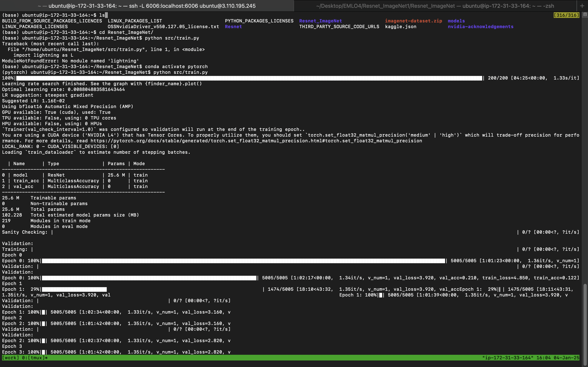

# ImageNet Classification with ResNet50

This project implements a ResNet50-based image classifier for the ImageNet dataset using PyTorch Lightning trained on EC2 g6 instance

## HuggingFace Space Link

https://huggingface.co/spaces/PriyePrabhakar/ResNet50_ImageNet_Classifier

## Project Structure

```
Resnet_ImageNet/
├── src/
│ ├── datamodules/
│ │ └── imagenet_datamodule.py
│ ├── models/
│ │ └── classifier.py
│ └── train.py
├── data/
│ └── imagenet-dataset/
│ ├── train/
│ └── val/
├── logs/
│ ├── checkpoints/
│ └── image_net_classifications/
└── requirements.txt
```

## Setup

1. Install dependencies:

   ```
   pip install -r requirements.txt
   ```

2. Prepare your ImageNet dataset in the following structure:

```
data/imagenet-dataset/
├── train/
│ ├── class1/
│ ├── class2/
│ └── ...
└── val/
├── class1/
├── class2/
└── ...
```

##EC2 instance


## Training Iterations




## Training Logs


## Training Process

The training pipeline includes several key components:

1. **Automatic Learning Rate Finding**

   - Uses `torch-lr-finder` to determine optimal learning rate
   - Performs an exponential sweep from 1e-7 to 1
   - Selects 1/10th of the learning rate with minimum loss

2. **Data Preprocessing**

   - Training augmentations:
     - Random resized crop to 224x224
     - Random horizontal flip
     - Normalization with ImageNet stats
   - Validation transforms:
     - Resize to 256x256
     - Center crop to 224x224
     - Normalization

3. **Model Architecture**

   - ResNet50 backbone (from timm library)
   - 1000 output classes
   - Cross-entropy loss
   - Adam optimizer

4. **Training Configuration**
   - Mixed precision (bfloat16)
   - Batch size: 256
   - Learning rate scheduler: ReduceLROnPlateau
     - Reduces LR by factor of 0.1
     - Patience of 3 epochs
   - Validation every epoch
   - Saves top 3 models based on validation loss

## Training

To start training from scratch:

```
python src/train.py
```

## Monitoring

Training progress can be monitored using TensorBoard:

```
tensorboard --logdir logs --port 6006 --bind_all
```
